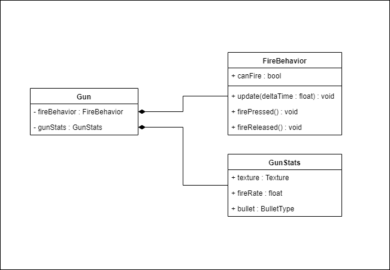

#Enemy weapon research
We have different kind of weapons for enemies. Saving them all as different gameobjects is possible, but we can do it easier. All weapons have a type (semi-automatic, automatic, charge). The only things that they differ in are their texture, weapon stats (damage, fire rate), and bullets. Because of this we can use **Scriptable objects**.

## Example structure
We have a base class called Gun. Gun takes a FireBehavior class and a GunStats scriptable object. We are using a combination of the strategy pattern so that we can easily add new weapons and the flyweight pattern because we can easily save space, why wouldn't we. 

This design should satisfy all our needs for the enemy weapons